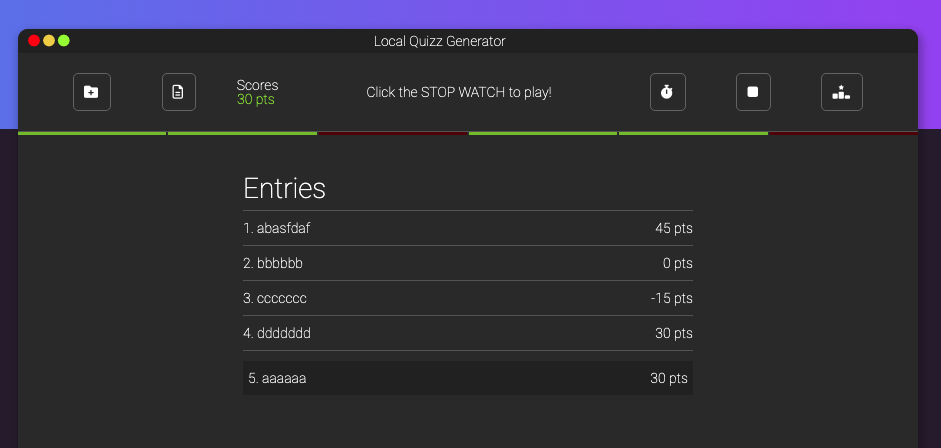

# local-quiz-generator

### Author: Hai Duong
#### Demo link: [Try me](https://caubenondo.github.io/local-quiz-generator/)
### Description
This application will let users to quiz themselves at limited time, with the question bank that they create.

### Get Started: build your question bank
1. Click on the + folder icon on navbar
2. Fill in the form with your question and answers
3. Repeat step 2 until you ran out of questions
4. Click on the list icon on navbar to check you question bank
5. You can delete ones that you don't like

### Play the Game
1. Click on the stopwatch icon on the navbar
2. The counter will start at 20s and count down 
3. The app will prompt you a random question and its 4 answers from your question bank
4. If you select the right answer, you will recieve 10pts and +5s bonus
5. If you select wrong answer, you will recieve -5pt and -2s
6. You collect point by answer as many questions as you can in a time limit
7. You can stop the quiz any time with Stop button. 
8. Once the counter reaches 0, the app will show your points and ask you for your name to put onto Entries Board
9. The app will show you the whole list of entries and highlight your name
10. Click the Ranking button if you want to see Leader Board, where it lists all entries in a sorted order by points

#### Important Note:
**Because the app takes advantage of Local Storage of browser, you need to build your question bank before playing the Quiz game.**

#### App in action:

